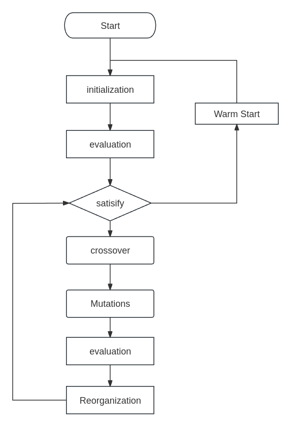
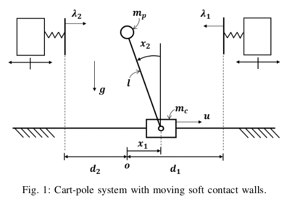
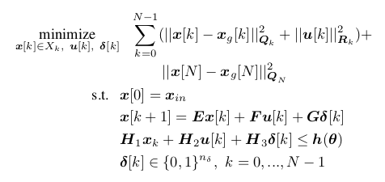
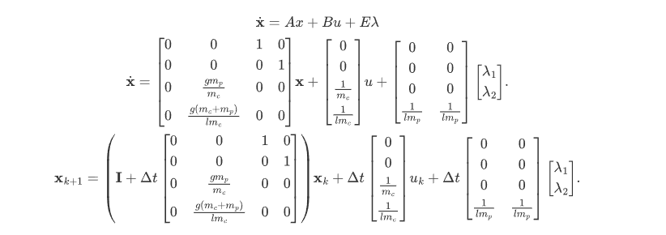

### Cart Pole Result

### FLOW

### System

The coordination of this system is located at the center. right side is positive, left side is negative. The pole swings leftwards for positive, and vice versa for negative.

### MPC  Model

Where $x_g[k]$ represents the control target for $x[k]$. 

The matrices $Q_k$ and $Q_N$ are positive definite matrices.

$X_k$ is the domain of $x[k]$. The system is written into a more compact form.

### Linear Model

Set the state variable as $x_1 = pos, x_2 = \theta, x_3 = v, x_4 = \dot \theta$. And the runtime step is $\Delta t = 0.02$. The system can be described as:

where $\lambda$ is the force from the left and right wall. $\lambda_1$ is the left, $\lambda_2$ is the right wall.

### Constraint of System

Constraints of system:

- cart position constraint: $-0.6 \leq x_1 \leq 0.6$

- theta constraint: $-\pi/2 \leq x_2 \leq \pi/2$

- speed constraint: $-2\times 0.6 / \Delta t \leq x_3 \leq 2 \times 0.6/ \Delta t$, where $2 \times 0.6$ is the available space for cart pole

- $\dot \theta$ constraint: $-\frac{\pi}{\Delta t} \leq x_4 \leq \frac{\pi}{\Delta t}$

- control input (u) constraint: $-20 \leq u \leq 20$

- $\lambda$  constraint: $0 \leq \lambda_1, \lambda_2 \leq 20$

- cart and pole position constraint:

  - $x_1 - l x_2 \leq wall_{right}$,

  - $x_1 - l x_2 \geq wall_{left}$, 

  - $D_{max} = 1.2$

    where $D_{max}$ is the maximal distance from origin, $c_{left, right}$ is the bias of left or right wall from the $D_{max}$

### Non-linear Dynamic Model

$$
a = \frac{-\dot{\theta}^2l m_p\sin(\theta) + \frac{g m_p\sin(2\theta)}{2} + \lambda_1\cos^2(\theta) - \lambda_1 - \lambda_2\cos^2(\theta) + \lambda_2 + F}{m_c + m_p\sin^2(\theta)}
$$

$$
\ddot{\theta} = \frac{-\dot{\theta}^2l m_p^2\sin(2\theta)/2 + g m_c m_p\sin(\theta) + g m_p^2\sin(\theta) + \lambda_1 m_c\cos(\theta) - \lambda_2 m_c\cos(\theta) + m_p F\cos(\theta)}{l m_p(m_c + m_p\sin^2(\theta))}
$$

### Kinematic equations

Update equations for the cart-pole system:

Velocity update: $v_{t+1} = v_t + a\Delta t$

Position update: $x_{t+1} = x_t + v_t\Delta t + \frac{1}{2}a\Delta t^2$

Angular velocity update: $\dot{\theta}_{t+1} = \dot{\theta}_t + \ddot{\theta}\Delta t$

Angular position update: $\theta_{t+1} = \theta_t + \dot{\theta}_t\Delta t + \frac{1}{2}\ddot{\theta}\Delta t^2$

where:
- $v_t$ is the velocity at time $t$
- $x_t$ is the position at time $t$
- $\theta_t$ is the angle at time $t$
- $\dot{\theta}_t$ is the angular velocity at time $t$
- $\ddot{\theta}$ is the angular acceleration
- $\Delta t$ is the time step
- $a$ is the linear acceleration

#### Contact with Wall

##### pole position

$$
\begin{align*}
x_{pole1} &= -(l\sin(\theta) - x) \\
x_{pole2} &= l\sin(\theta) - x
\end{align*}
$$

where $x_{pole1}$ is the case where the pole is tilted to the right. $x_{pole2}$ for the left.

##### force from wall

$$
\lambda_1 = \begin{cases}
k_1(x_{pole1} - x_{wall,R}) & \text{if } x_{pole1} \geq x_{wall,R} \\
0 & \text{otherwise}
\end{cases}
$$

$$
\lambda_2 = \begin{cases}
k_2(x_{pole2} - x_{wall,L}) & \text{if } x_{pole2} \leq x_{wall,L} \\
0 & \text{otherwise}
\end{cases}
$$

### Reference:

https://courses.ece.ucsb.edu/ECE594/594D_W10Byl/hw/cartpole_eom.pdf

https://richardrl.github.io/lyapunov-cart/lyapunov_controller.pdf (Some operators in this paper do not match this system)
